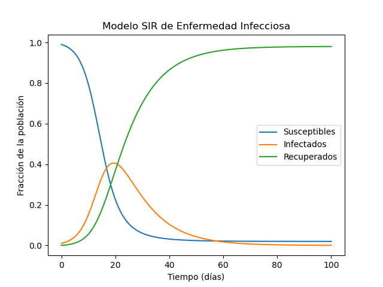

# Modelo SIR de Enfermedad Infecciosa

## SIR

El modelo SIR es un modelo matemático simplificado que describe cómo se propaga una enfermedad infecciosa en una población. El modelo se basa en un sistema de tres ecuaciones diferenciales que describen las tasas de cambio de las poblaciones Susceptible (S), Infectado (I) y Recuperado (R) con respecto al tiempo. Estas poblaciones se definen de la siguiente manera:

- **Susceptible (S):** Individuos que no han sido infectados y que, por lo tanto, pueden contraer la enfermedad.
- **Infectado (I):** Individuos que actualmente tienen la enfermedad y pueden transmitirla a individuos susceptibles.
- **Recuperado (R):** Individuos que se han recuperado de la enfermedad y, por lo tanto, no pueden volver a infectarse ni transmitir la enfermedad.

El modelo utiliza dos parámetros principales:

- **Tasa de infección (beta):** La probabilidad de que un individuo susceptible se infecte al entrar en contacto con un individuo infectado.
- **Tasa de recuperación (gamma):** La proporción de individuos infectados que se recupera por unidad de tiempo.

Al resolver este sistema de ecuaciones, se puede estudiar la dinámica de la propagación de la enfermedad y evaluar el impacto de diferentes parámetros en la evolución de la epidemia.

1. Importar las funciones necesarias desde el script de utilidades: `dudt` y `create_time_array`.
2. Definir la función `sir_eq` que representa el sistema de ecuaciones diferenciales del modelo SIR. Esta función toma las variables de estado (Susceptible `S`, Infectado `I` y Recuperado `R`), el tiempo `t` y los parámetros del modelo (`beta` y `gamma`), y devuelve las derivadas dS/dt, dI/dt y dR/dt.
3. Especificar las condiciones iniciales para las poblaciones de Susceptible, Infectado y Recuperado, y almacenarlas en la lista `u0`.
4. Definir los parámetros del modelo SIR: la tasa de infección `beta` y la tasa de recuperación `gamma`.
5. Crear un array de puntos de tiempo utilizando la función `create_time_array`.
6. Resolver el sistema de ecuaciones diferenciales utilizando la función `dudt`, que toma como argumentos la función que representa el sistema de ecuaciones (`sir_eq`), las condiciones iniciales (`u0`), el array de puntos de tiempo (`t`) y los parámetros del modelo (`params`).
7. La función `dudt` devuelve la solución numérica del sistema de ecuaciones diferenciales como un array de valores para `S`, `I` y `R` en cada punto de tiempo.
8. Utilizar Matplotlib para visualizar la evolución de las poblaciones de Susceptible, Infectado y Recuperado a lo largo del tiempo.

